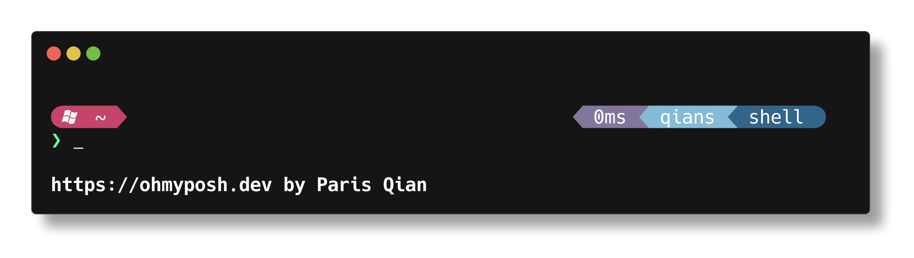

# Hunk Theme for Oh-my-posh 3

Besically a customised M365Princess theme for the real man

## Selling points:

- Good Layout
  - Most important infomation like path git is put on the left, some less important segments are put on the right.
- Power mode indicator
  - You'll see a flash icon if you are on Administrator(root) privilege.
- Confortable colors: calm but not bland, vivid but not too bright. Perfect pinky style for a real man

>**Warning**: Only tested on Powershell 7.1.5 with DejaVuSansMono NF

## Recommended settings 

- Font size: 12+
- Font family: DejaVuSansMono NF (Any Windows-compatible nerd fonts will do)

## Inspiration

- M365Princess
- iterm2
- jandedobbeleer
- powerlevel10k